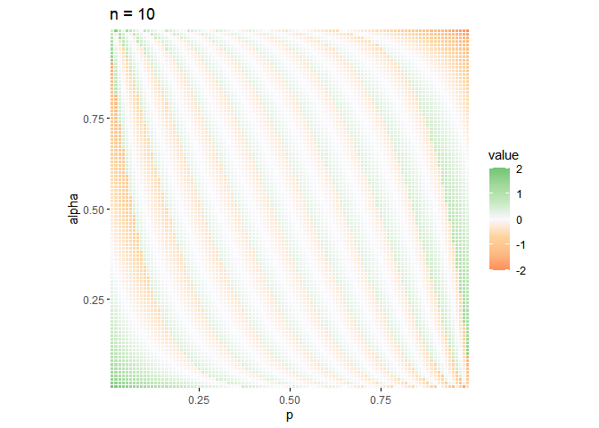
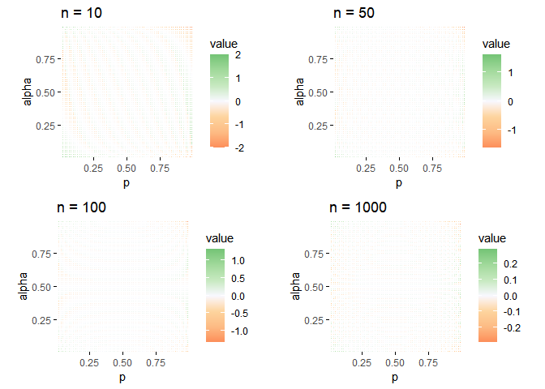

在这一节中, 将考虑作为非参统计中入门课的二项检验. 
二项检验是利用多次重复伯努利试验所得数据对总体成功概率 p 进行统计推断.
在非参数统计中, 由二项检验可以直接导出符号检验和分位数检验.

<!--more-->

## 1 假设

1. 有一组 n 次重复伯努利试验数据(独立同分布于), 其中成功次数记为 x
2. $x\sim B(n,p)$

## 2 临界值

规定 $B_{\alpha/2}(n,p)$ 为满足
$$
\sum _ { i = 0 } ^ { c _ { 1 } }\binom{n}{i} p _ { 0 } ^ { i } ( 1 - p _ { 0 } ) ^ { n - i } \leq \frac { \alpha } { 2 }
$$
的最大整数$c_1$;

同理, 规定 $B_{1-\alpha/2}(n,p)$ 为满足
$$
\sum _ { i = c_2 } ^ { n }\binom{n}{i} p _ { 0 } ^ { i } ( 1 - p _ { 0 } ) ^ { n - i } \leq \frac { \alpha } { 2 }
$$
的最小整数


## 3 双边检验

### 3.1 检验假设

$$
H_0:p=p_0\longleftrightarrow H_1:p\neq p_0
$$


### 3.2 检验统计量

原假设下,以 $x\sim B(n,p_0)$ 作为检验统计量

### 3.3 拒绝域

对于给定的$\alpha$,拒绝域为:

$$
W=\{x\leq B_{\alpha/2}(n,p_0)\}\cup\{x\geq B_{1-\alpha/2}(n,p_0)\}
$$

### 3.4 p 值

$x_0$为统计量$x$的一个观测值,

$$
2\min\{P(x\leq x_0),P(x\geq x_0)\}
$$

## 4 左边检验

### 4.1 检验假设

$$
H_0:p=p_0\longleftrightarrow H_1:p\leq p_0
$$


### 4.2 检验统计量

原假设下,以 $x\sim B(n,p_0)$ 作为检验统计量

### 4.3 拒绝域

对于给定的$\alpha$,拒绝域为:

$$
W=\{x\leq B_{\alpha}(n,p_0)\}
$$

### 4.4 p 值

$x_0$为统计量$x$的一个观测值,

$$
P(x\leq x_0)
$$


## 5 右边检验

### 5.1 检验假设

$$
H_0:p=p_0\longleftrightarrow H_1:p\geq p_0
$$


### 5.2 检验统计量

原假设下,以 $x\sim B(n,p_0)$ 作为检验统计量

### 5.3 拒绝域

对于给定的$\alpha$,拒绝域为:

$$
W=x\geq B_{1-\alpha}(n,p_0)
$$

### 5.4 p 值

$x_0$为统计量$x$的一个观测值,

$$
P(x\geq x_0)
$$


## 6 大样本近似

### 6.1 近似方法

由于计算上的复杂性, 在样本量较大时, 考虑对上述检验临界值的计算使用正态分布近似.
具体而言, 根据中心极限定理, 对于充分大的 n, 有:

$$
x\stackrel{.}{\sim}N(Ex,Dx)=N(np,np(1-p))
$$
据此构造统计量:
$$
u=\frac{x-Ex}{\sqrt{D(x)}}=\frac{x-np}{\sqrt{np(1-p)}}\stackrel{.}{\sim}N(Ex,Dx)
$$
便有检验拒绝域:

$$
\left. \begin{array}  { l  }  { W = \{ u \leq u _ { \alpha \} } } \\ { W = \{ u \geq u _ { 1-\alpha } \} } \\ { W = \{ | u | \geq u _ { 1 - \alpha / 2 } \} } \end{array} \right.
$$
同时有检验 p 值:

$u_0$是统计量的观测值,

$$
p=P(u\leq u_0)
$$
$$
p=P(u\geq u_0)
$$


$$
p=2\min\{P(u\geq u_0),P(u\leq u_0)\}=2P(u\geq u_0)=2P(u\leq u_0)
$$


### 6.2 近似程度评估

在这部分, 会根据给定的 n 绘制一个热图, 
横坐标为成功概率 p, 纵坐标为显著性水平 $\alpha$,
而热图的颜色则表示二项分布与正态分布的分位数差值 $\alpha$, 定义为:
$$
diff={\frac{B_\alpha(n,p)-np}{\sqrt{np(1-p)}}-N_\alpha(0,1)}
$$
差值刻画了近似的准确性, 越接近于 0, 说明越正态分布近似得越好


#### 6.2.1 准备工作

编写一个绘制热力图的函数, 便于查看结果.

这个函数会把数据矩阵以热力图形式展示.

```r
plot_mat <- function(mat) {
  library(ggplot2)

  dat <- reshape2::melt(mat)

  colnames(dat) <- c("p", "alpha", "value")
  .color <- c(
    RColorBrewer::brewer.pal(9, "OrRd")[5:3],
    "#f8f8ff", RColorBrewer::brewer.pal(9, "Greens")[3:5]
  )

  dat %>%
    ggplot(aes(x = p, y = alpha, fill = value)) +
    geom_tile(colour = "white") +
    coord_equal() +
    scale_x_continuous(expand = c(0, 0)) +
    scale_y_continuous(expand = c(0, 0)) +
    scale_fill_gradientn(
      colors = .color,
      na.value = NA
    ) +
    theme_minimal() +
    theme(axis.ticks = element_line(size = 0.4))
}
```


#### 6.2.2比较结果

编写一个绘制函数

```r
plot_diff <- function(n) {
  epsilon <- 1e-2
  ps <- seq(epsilon, 1 - epsilon, epsilon)
  alphas <- seq(epsilon, 1 - epsilon, epsilon)

  theta <- outer(ps, alphas, function(p, .alpha) {
    Ex <- n * p
    Dx <- n * p * (1 - p)
    (qbinom(.alpha, n, p) - Ex) / sqrt(Dx) - qnorm(.alpha)
  })
  rownames(theta) <- ps
  colnames(theta) <- alphas
  plot_mat(theta) + labs(title = paste0("n = ", n))
}
plot_diff(10)
```




```r
p1 <- plot_diff(10)
p2 <- plot_diff(50)
p3 <- plot_diff(100)
p4 <- plot_diff(1000)

cowplot::plot_grid(p1, p2, p3, p4, nrow = 2, ncol = 2)
```



从上面的结果看到, 随着样本量 n 的增大, 正态近似结果愈发接近于真实情况.
