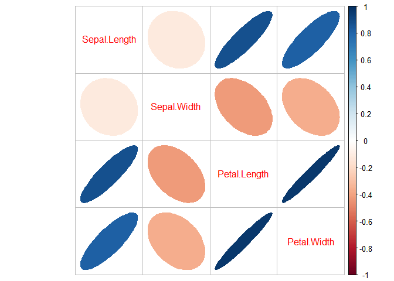
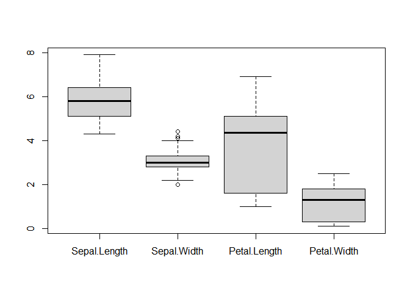

# r blogdown and hugo


在这篇文章中, 我将叙述使用 rblogdown 和 hugo 更新博客的基本流程. 经过测试, 在本博客使用的主题上, 先将 Rmd 文件 knit 为 html, 再由 hugo 渲染会报错. 经过一番探索, 我将方案改为将 Rmd 文件转换为 md 文件, 再由 hugo 渲染.

<!--more-->

## 1 Rmd文件转换

使用如下语句,将文件转为 markdown

``` r
library(rmarkdown)
# by not using pandoc to save the meta msg before the markdown document
# like `title`, `author`, `tags` etc.
render("./your_file.Rmd", md_document(),run_pandoc = F)
```

帮助文档: [render](<https://rmarkdown.rstudio.com/docs/reference/render.html>) [md_document](<https://rmarkdown.rstudio.com/docs/reference/md_document.html>)

## 2 测试Rmd

注意到, RStudio 支持同时使用多种语言进行编程, 所以此处我也测试了执行 python


```r
data = iris[,1:4]
head(data)
```

```
##   Sepal.Length Sepal.Width Petal.Length Petal.Width
## 1          5.1         3.5          1.4         0.2
## 2          4.9         3.0          1.4         0.2
## 3          4.7         3.2          1.3         0.2
## 4          4.6         3.1          1.5         0.2
## 5          5.0         3.6          1.4         0.2
## 6          5.4         3.9          1.7         0.4
```

```r
summary(data)
```

```
##   Sepal.Length    Sepal.Width     Petal.Length    Petal.Width   
##  Min.   :4.300   Min.   :2.000   Min.   :1.000   Min.   :0.100  
##  1st Qu.:5.100   1st Qu.:2.800   1st Qu.:1.600   1st Qu.:0.300  
##  Median :5.800   Median :3.000   Median :4.350   Median :1.300  
##  Mean   :5.843   Mean   :3.057   Mean   :3.758   Mean   :1.199  
##  3rd Qu.:6.400   3rd Qu.:3.300   3rd Qu.:5.100   3rd Qu.:1.800  
##  Max.   :7.900   Max.   :4.400   Max.   :6.900   Max.   :2.500
```


```r
corrplot::corrplot(cor(data),
         tl.pos = 'd',method='e')
```




```r
boxplot(data)
```




```python
print('hello world')
```

```
## hello world
```


